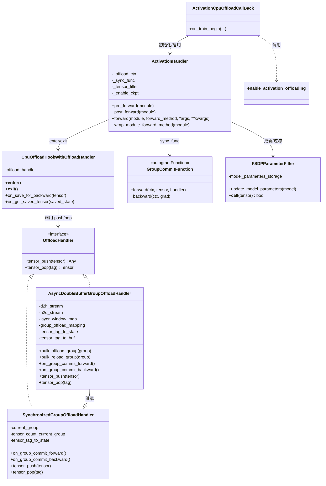

# 激活（Activation）CPU Offload 设计文档（ms-swift）

本文档梳理 `swift/callbacks/activation_cpu_offload.py` 中激活 CPU Offload 的 **动机、架构、核心实现原理、价值与权衡、以及技术难点**。

## 动机（Motivation）

大模型（LLM/MLLM）训练经常受限于 **激活显存（activation memory）**：

- 即使使用了 FSDP/ZeRO 类的参数/梯度/优化器状态分片，**反向需要保存的中间激活（saved for backward）** 仍可能成为显存峰值的主要来源。
- 激活检查点（activation checkpointing / gradient checkpointing）可以显著降低激活显存，但会引入重算开销。
- CPU offload 的目标是：把 “saved-for-backward” 张量从 GPU 迁移到 CPU，降低 GPU 峰值显存；并尽量通过 **计算与拷贝重叠** 来减少性能损失。

该实现主要面向常见场景：

- 使用 FSDP/FSDP2 训练（大量 transformer block 被 wrap），激活显存限制 batch size / seq len。
- 允许额外 CPU 内存与 PCIe/NVLink 传输开销，以换取更大的 GPU 显存余量。

## 目标与非目标（Goals / Non-goals）

**目标**

- forward 时将 saved-for-backward 的张量从 GPU offload 到 CPU。
- backward 需要这些张量前将其 reload 回 GPU。
- 提供可选的 **异步** offload/reload 路径，尽量与计算重叠。
- 通过 Trainer callback + `fsdp_config` 小开关，方便在 FSDP/FSDP2 下启用。

**非目标**

- 通用的任意张量交换（只聚焦 autograd 保存的张量）。
- 对所有模型结构都给出最优调度（这里假设“层状/块状”结构）。
- 在该文件中支持除 FSDP/FSDP2 之外的训练策略（代码中显式断言）。

## 核心实现原理（Core Principle）

PyTorch autograd 提供了对 “saved tensors” 的 hook 能力：

- forward 阶段，很多算子会调用 `ctx.save_for_backward(tensor)` 保存张量；
- backward 阶段，autograd 会取回这些张量以计算梯度。

### 什么是 hook？它有什么作用？

这里的 **hook** 可以理解成“回调函数/拦截器”：

- 你把一个函数注册到系统里；
- 系统在某个事件发生时（例如“要保存张量”“要取回张量”）就会自动调用你注册的函数；
- 你可以在 hook 里做额外的事情（例如记录日志、改写输入输出、触发拷贝），再把结果返回给系统继续执行。

本功能使用的是 **autograd saved-tensor hooks**，对应两个事件：

- **save hook**：当 autograd 想“把某个张量保存起来供 backward 用”时触发  
  → 我们可以把 GPU 张量搬到 CPU，并返回一个 tag 让 autograd 保存。
- **load hook**：当 backward 需要这个张量时触发  
  → 我们根据 tag 找到 CPU 副本，把它搬回 GPU 并返回给 autograd。

为什么 hook 很关键：

- 不用改模型/算子实现，只要在外部注册 hook，就能改变“张量如何被保存/取回”的方式；
- hook 是在 autograd 正确的时序点触发的，因此更容易保证正确性（不会提前/延后到错误时机）。

### hook 和 Offload Handler 如何协作？

可以把它们理解成“电话总机”和“仓库管理员”的分工：

- **hook（总机）**：只负责在关键事件发生时接到电话，并把请求转给负责处理的人；自己不做复杂决策。  
- **Offload Handler（仓库管理员）**：决定怎么存、存到哪、什么时候搬运、怎么取回，并维护所有状态。

协作过程就是两次调用（save 和 load），对应 forward/backward：

1) **forward：保存阶段（save hook → `tensor_push`）**

- autograd：我需要把 `tensor` 保存起来，之后 backward 会用到  
  → 触发 save hook：`on_save_for_backward(tensor)`
- hook：把张量交给 handler：`tag = handler.tensor_push(tensor, ...)`
- handler：按策略处理（同步/异步/是否分组）：
  - 同步策略：立刻拷到 CPU 并记录 state；
  - 异步策略：先登记到当前 group，等 commit 点再 bulk offload；
  - 过滤策略：如果判断不该 offload，就直接返回“原 tensor 本身”当作 tag（等价于不介入）。
- hook：把 `tag` 返回给 autograd 保存  
  → 计算图里保存的就不是原 GPU tensor，而是这个 tag。

2) **backward：取回阶段（load hook → `tensor_pop`）**

- autograd：我要取回之前保存的东西（现在保存的是 `tag`）  
  → 触发 load hook：`on_get_saved_tensor(tag)`
- hook：把 tag 交给 handler：`tensor = handler.tensor_pop(tag, ...)`
- handler：按策略返回可用 tensor：
  - 同步策略：此时把 CPU 副本拷回 GPU 再返回；
  - 异步策略：通常假设在 `on_group_commit_backward()` 已经 bulk reload 完成，此处直接返回；
  - 若 tag 本身就是 tensor（“不介入”路径），直接返回即可。
- hook：把 `tensor` 返回给 autograd，供 backward 继续计算梯度。

为什么要把协作拆成 hook + handler 两层：

- hook 层必须非常薄：它运行在 autograd 的关键路径上，越简单越不容易出错；
- handler 层可以自由扩展：可以换不同策略、加流同步、做 bulk、加过滤、做去重等，而不影响 hook 的安装方式。

本实现利用：

`torch._C._autograd._push_saved_tensors_default_hooks(save_hook, load_hook)`

做到：

1. 拦截 `save_for_backward`：把本应保存的 tensor **替换为一个轻量 tag（标识符）**；
2. 把真实 tensor 的数据存到别处（CPU 副本，或先登记后批量 offload）；
3. backward 取回时：根据 tag 恢复真实 tensor（必要时先 reload 回 GPU）。

这个“拦截 saved tensor”的思路，使得在 **不改模型代码** 的情况下实现激活 offload 成为可能。

## 架构总览（Architecture）

实现可以分成三层：

1. **Hook 封装层（机制层 / “拦截器”）**
   - **负责什么**：只负责把 PyTorch autograd 的 saved-tensor hook “接上/拔掉”，并把事件转交给 handler。
   - **不负责什么**：不决定要不要 offload、什么时候 offload、怎么预取；不管理 stream；不关心分组。
   - **核心接口**：
     - forward 保存时：`on_save_for_backward(tensor) -> tag`
     - backward 取回时：`on_get_saved_tensor(tag) -> tensor`
   - **对应实现**：`CpuOffloadHookWithOffloadHandler`。

2. **Offload Handler 层（策略层 / “仓库管理员 + 调度器”）**
   - **负责什么**：决定“保存/取回”时的策略与数据存放位置：
     - `tensor_push`：收到要保存的 tensor 后，是立刻拷到 CPU，还是先登记到某个组里，还是不处理；
     - `tensor_pop`：收到 tag 后如何返回可用 tensor（必要时触发 reload / 等待预取完成）。
   - **同时负责**：管理内部状态与性能相关细节（tag→state 映射、分组计数、bulk offload/reload、stream 与同步点等）。
   - **对应实现**：
     - `SynchronizedGroupOffloadHandler`：简单同步 copy（正确性优先）。
     - `AsyncDoubleBufferGroupOffloadHandler`：异步双 stream + 批量搬运（性能优先）。

3. **模型集成层（应用层 / “把机制装到模型上”）**
   - **负责什么**：把“机制层 + 策略层”真正应用到训练的模块执行路径上：
     - 确定 offload 的作用域：哪些层需要开启 hooks、何时进入/退出；
     - 给 handler 提供稳定的“分组边界/路标”（commit 点），让 handler 能按层推进 offload/reload；
     - 处理与 checkpoint 的兼容（必要时替换实现）。
   - **对应实现**：
     - `ActivationHandler`：wrap 模块 forward（进入 hooks、执行 forward、commit、退出 hooks）。
     - `enable_activation_offloading`：扫描模型，选择要 wrap 的层，装配 handler/context/sync_func。
     - `ActivationCpuOffloadCallBack`：从配置触发一次性启用（入口）。

责任划分的一句话总结：

- **Hook 层**：负责“拦截事件并转发”（不做决策）。  
- **Handler 层**：负责“怎么搬、何时搬、搬到哪、怎么取回”（做决策 + 管状态）。  
- **集成层**：负责“把它装到模型执行路径里，并提供稳定时序/作用域”（让前两层真正跑起来）。

### 三层在“端到端流程”里如何协作（从架构角度看协作与职责）

如果把一次训练 step 视为一条流水线（forward → backward），三层协作关系可以这样理解：

1) **集成层**决定“在哪里启用机制、在哪里触发调度”

- 它把 offload 功能“装”到模型上：选择哪些层需要包裹、每层 forward 的前后何时进入/退出 hooks、每层结束时插入 commit 点。
- 因此它掌握两个关键边界：
  - **作用域边界**：哪些算子产生的 saved tensors 会被拦截（只在 hooks 上下文内）；
  - **时序边界**：handler 何时推进 group、何时 bulk offload/reload（靠 commit 点在 forward/backward 对称触发）。

2) **Hook 层提供“统一的拦截入口”，把 autograd 事件变成 handler 的 push/pop 调用**

- 对外（对 PyTorch autograd）只有两个入口：
  - save：把“要保存的 tensor”交给 handler，并把 handler 返回的 tag 回传给 autograd；
  - load：把 autograd 保存的 tag 交给 handler，并把 handler 返回的 tensor 回传给 autograd。
- 这层的职责就是把 autograd 的事件语义稳定地映射到 handler 接口上，避免在 autograd 关键路径里塞入复杂策略逻辑。

3) **Handler 层实现“策略与状态机”，在正确的时机完成数据搬运**

- Handler 是系统里唯一“真正决定怎么 offload/reload”的地方：
  - push/pop 的策略（同步/异步/过滤/去重）；
  - 分组状态（`current_group` 等）与 tag→state 映射；
  - bulk offload/reload 的触发与 stream 同步。
- 它依赖集成层提供的两个信号：
  - **push/pop 信号**：来自 hooks（每个 saved tensor 的保存/取回时机由 autograd 驱动）；
  - **commit 信号**：来自 `GroupCommitFunction`（按“层边界”推进 group、安排 bulk 搬运/预取）。

把三者合在一起就是：

- 集成层把“开关”和“路标”插到模型执行路径中；
- Hook 层把 autograd 的保存/取回动作拦截出来；
- Handler 层在这些信号驱动下完成实际搬运，并保证 backward 能拿到正确的 tensor。

为了让协作清晰，可以把“接口契约”总结为：

- **Hook ↔ Handler 契约**：`tensor_push(tensor)->tag` / `tensor_pop(tag)->tensor`  
  hook 承诺按 autograd 事件调用，handler 承诺 tag 可索引且能恢复等价 tensor。
- **集成层 ↔ Handler 契约**：每层结束插入 commit 点（forward/backward 对称），handler 以此作为 bulk 搬运的时序锚点。

## 关键组件（Key Components）

> 读前小词典（尽量用“非深度学习系统”视角理解）  
> - **激活（activation）**：forward 过程产生的中间结果；为了算梯度，backward 往往需要其中一部分。  
> - **saved for backward**：PyTorch autograd 在 forward 里把某些中间张量“存起来”，供 backward 使用。  
> - **offload / reload**：把张量从 GPU 拷到 CPU（offload），以及在需要时再拷回 GPU（reload）。  
> - **pinned memory**：一种 CPU 内存页锁定方式，让 GPU↔CPU 拷贝更快/更容易异步。  
> - **stream**：GPU 上的“任务队列”。不同 stream 的任务可以并行重叠，但需要显式同步保证顺序正确。  

下面按“如果你完全没相关背景”来解释：这套机制本质上做了三件事：

1. **拦截**：在 forward 保存激活时，不让 autograd 真的把 GPU 张量保存在计算图里；  
2. **替换**：把要保存的 GPU 张量换成一个“小纸条”（tag），真正的数据搬到 CPU；  
3. **恢复**：backward 需要时，拿着“小纸条”把对应的张量从 CPU 取回并搬回 GPU。

这样 GPU 上就不会长时间持有大量“未来要用的中间结果”，峰值显存会下降。

### 1) `CpuOffloadHookWithOffloadHandler`

职责与功能（更细化）：

- `__enter__`：安装 saved-tensor hooks：
  - `on_save_for_backward(tensor)` → `handler.tensor_push(tensor)` 返回一个标识符；
  - `on_get_saved_tensor(id)` → `handler.tensor_pop(id)` 返回真实 tensor。
- `__exit__`：卸载 hooks。

要点：

- hook 不关心策略细节；同步/异步/分组/预取等都由 handler 实现。
- “保存的对象”在 autograd 里会被替换为 `tensor_push` 返回的 **retrieve_identifier**（可以是 tuple/int/任意可 picklable 的小对象），因此 handler 需要保证：
  - `tensor_push` 返回的标识符在整个 forward→backward 生命周期内可用于索引；
  - `tensor_pop` 能在 backward 中按需返回与原张量 **同 dtype/shape/device 语义一致** 的 tensor（通常为原 device 上的 tensor）。
- 该 hook 的作用范围由上下文控制：`ActivationHandler.pre_forward()` 进入上下文，`post_forward()` 退出上下文，因此 offload 只覆盖被 wrap 的 module forward 执行期间产生的 saved tensors。

用一句“故事”解释这段逻辑：

- 没有 offload：autograd 说“这个中间结果我以后要用”，于是把 GPU 张量放进“储物间”（显存里一直占着）。  
- 有 offload：我们把这个 GPU 张量搬到 CPU 的“仓库”，并在储物间里只留一个“取货码”（tag）。  
  以后需要时（backward），拿取货码把货从仓库取回 GPU。

### 2) 以 “offload group” 为单位的调度

现实中的关键难点是时序调度：

- offload 太早：拷贝/同步会阻塞计算；
- offload 太晚：显存峰值降不下来。

该实现引入 **group**（近似“按层分组”）：

- 每个被 wrap 的 module forward 结束都会插入一次 **commit 点**；
- handler 依据 commit 点进行：
  - 旧 group 的 bulk offload；
  - 释放旧 group 的 GPU 引用（让显存可回收）；
  - backward 前的 bulk reload / 预取。

更具体地讲，本实现把“一个 module forward 期间产生的 saved tensors”归入当前 `current_group`，并通过 commit 推进 group：

- `current_group`：当前组编号（forward 递增，backward 递减）。
- `tensor_count_current_group`：当前组内 saved tensor 计数，用于生成稳定 tag。
- tag 形式通常为 `(group_id, tensor_idx)`：既能区分组，又能在组内稳定索引。

为什么要“分组”而不是“每出现一个张量就立刻 offload”：

- 每个张量单独调度会产生大量小拷贝与同步点，开销很大；
- 按“层/块”分组可以把同一层产生的一堆张量合并成批量操作（bulk offload/reload），更容易优化；
- 也更贴合 transformer：一层算完后，上一层的激活通常短期内不会再被用到（直到 backward 回来）。

### 3) `GroupCommitFunction`（dummy autograd op）

`GroupCommitFunction` 输出与输入相同，但会回调 handler：

- forward：`on_group_commit_forward()`
- backward：`on_group_commit_backward()`

这给 handler 提供两个确定的“时间点”：

- 每层 forward 后的确定事件；
- backward 过程中对应位置的确定事件。

为什么必须用“autograd Function”而不是普通 Python 调用：

- handler 需要在 **forward 和 backward 都被调用**，并且调用时机要与 autograd 拓扑一致；
- 用 `torch.autograd.Function` 可以把“提交点”插入计算图，保证 backward 过程能触发对称的 `on_group_commit_backward()`；
- 由于该 op “输入=输出”，不会改变模型数值语义，只提供调度信号。

可以把它理解成“在流水线上贴一个路标”：

- forward 每跑完一层，贴一个路标：告诉 handler “这一层的激活都收集完了，可以考虑把更早的那一层搬走”。  
- backward 走回头路时，又遇到这些路标：告诉 handler “快到某一层了，提前把那一层的激活搬回 GPU”。  

路标本身不改变数据（输入等于输出），只用来让搬运时机可控。

### 4) `SynchronizedGroupOffloadHandler`（同步版本）

机制：

- `tensor_push`：
  - 生成 `(group_id, tensor_idx)` tag；
  - 立刻分配 CPU buffer 并从 GPU copy 到 CPU（尽可能使用 pinned + non_blocking）；
  - state 存为 `(device, cpu_backup)`。
- `tensor_pop`：
  - 把 CPU backup copy 回原 device（`cpu_backup.to(dev)`）。

优点：

- 简单、稳定。

缺点：

- 拷贝与计算在同一 stream（等价于阻塞），性能损失可能明显。

NPU 说明：

- NPU 对 pinned + 异步拷贝支持不完整，因此走同步 copy。

适用场景：

- 用于验证正确性、或在异步流/同步点很难调的环境下作为保底方案；
- 当模型每层计算很短、通信无法被覆盖时，同步版本可能与异步版本性能接近但更稳定。

“同步”版本可以用一句话概括：

- forward 保存一个张量 → **立刻拷到 CPU**（可能阻塞）  
- backward 取回张量 → **立刻拷回 GPU**（可能阻塞）  

它的意义是：先把正确性跑通；如果你想要更高性能，再换异步版本。

### 5) `AsyncDoubleBufferGroupOffloadHandler`（异步双缓冲）

这是主要的性能导向实现。

核心点：

- 使用两个专用 stream：
  - `d2h_stream`：device→host；
  - `h2d_stream`：host→device。
- 维护关键映射：
  - `tensor_tag_to_state`：tag →（GPU tensor）或（轻量 `(key, shape)` 指向 CPU 存储）；
  - `group_offload_mapping`：group_id → `key -> (device, cpu_backup)`（bulk offload 的 CPU 存储）；
  - `tensor_tag_to_buf`：tag → GPU 引用（用于控制何时释放 GPU 侧引用）。
- 在 group 边界做 bulk offload/reload，降低 per-tensor 频繁调度开销。

双缓冲行为：

- 计算 group `i+1` 时，可以在 `d2h_stream` 上 offload group `i`；
- backward 时在真正需要前，提前在 `h2d_stream` 上 reload。

职责与关键数据结构（更细化）：

- `tensor_tag_to_state`：
  - forward 保存时先登记 GPU tensor；
  - 当某个 group 被 bulk offload 后，把对应条目替换为 `(key, shape)`，其中 `key` 用 `_get_unique_tensor_key` 去重（避免重复拷贝同一 storage），`shape` 用于 reload 后 view 回原形状。
- `group_offload_mapping[group_id]`：
  - 保存该组 bulk offload 的去重映射：`key -> (device, cpu_backup)`；
  - reload 时把 `cpu_backup` `.to(device)` 得到 GPU tensor，并可按 `shape` view 回去。
- `tensor_tag_to_buf`：
  - 持有需要延迟释放的 GPU 引用（否则 Python 引用丢失后可能过早释放/影响调度窗口）；
  - 在合适的同步点把旧 group 的引用置为 `None`，让显存更早可回收。
- `offloaded_group_count`：
  - 追踪当前已经推进到哪个 offload group，用于决定下一次 bulk offload / bulk reload 的目标 group。

同步与正确性保障（要点）：

- `d2h_stream.wait_stream(current_stream)` / `current_stream.wait_stream(d2h_stream)`：
  - 保证 offload 读取到的是 forward 计算完成后的 tensor；
  - 并在需要释放/进入下一窗口时确保拷贝完成，避免访问未完成的数据。
- backward 侧使用 `h2d_stream` 预取，并在 commit 点与当前 stream 做双向 wait，确保 `tensor_pop()` 时对应 group 已经 reload 完成。

如果你从来没用过 stream，可以这样理解“异步双缓冲”的目标：

- GPU 计算像在“主车道”跑；
- 我们开一条“辅路”专门做拷贝；
- 只要辅路的拷贝能在主车道用到之前完成，主车道就不会被迫停车等待。

什么时候会停车（性能变差）：

- 某一层计算太快、拷贝太慢（PCIe 带宽不足、CPU 内存不够快等）；
- 或者调度窗口不合适，导致需要同步等待拷贝完成。

窗口策略（`layer_window_map`）：

- 构造 “group_idx → 需要同步的 layer id” 映射，尝试把 offload 负载均匀分摊到 forward 过程；
- 目标是：
  - 更稳定地利用 CPU/GPU 互连带宽；
  - 避免某个时间点突然同步导致大 stall；
  - 理想情况下 GPU 同时保留的 group 很少（设计意图是“最多两组”）。

### 6) `FSDPParameterFilter`

为什么需要：

- saved-tensor hook 看到的张量不一定都是激活（可能包括参数相关张量）。

做什么：

- 记录模型参数的 storage 指针集合；
- `__call__` 只有在 tensor 的 storage 不属于参数集合时才返回 True（认为是可 offload 激活）。

价值：

- 避免误 offload 参数，减少无意义 CPU 传输。

细节：

- 该过滤器通过 `tensor.untyped_storage().data_ptr()` 与参数 tensor 的 storage 指针集合比对；
- 每次进入 module forward 前，`ActivationHandler.pre_forward()` 会调用 `update_model_parameters(module)` 更新集合，避免 FSDP 动态扁平化/重建参数导致指针变化时误判。

通俗理解：

- 我们只想搬“激活”，不想搬“参数”。  
- 但 hook 看到的 tensor 里可能混入参数相关 tensor。  
- 于是先记住“参数都长什么样（用 storage 指针代表）”，看见同一块存储就不搬。

### 7) 模型集成：`enable_activation_offloading`

该功能仅在 FSDP/FSDP2 下启用：

- 遍历模型，收集 FSDP/FSDP2 wrapped modules（并排除 embedding 这种激活很小的情况）；
- 通过 `get_activation_offload_context()` 创建 offload 上下文与 commit 函数；
- 用 `ActivationHandler.wrap_module_forward_method()` wrap 每个 module 的 forward。

与 checkpoint 的兼容：

- Transformers 自带的 gradient checkpointing 在某些策略下与 saved-tensor hooks 有冲突；
- 若 `enable_ckpt` 开启，则禁用 HF checkpointing（若存在对应 API），并在 `ActivationHandler` 内部用
  `torch.utils.checkpoint.checkpoint(use_reentrant=True)` 实现另一种 checkpoint，以便与 offload 共存。

更细节的执行形态：

- “找层”：递归遍历 `named_children()`，只要遇到 FSDP/FSDP2 wrapper 就把该 wrapper 视为一个 group（并收集到 `layers`）。
- “wrap forward 的对象”：
  - FSDP1：实际 wrap `child._fsdp_wrapped_module`（底层真实 module）；
  - FSDP2：直接 wrap 该 module（DTensor/FSDP2 的 wrapper 结构不同）。
- “分组数量”：
- `get_activation_offload_context(len(layers) - 1, len(layers), tensor_filter)`：默认 offload 的 group 数小于层数 1，
    目的是保留最后一组（最靠近 loss 的激活）在 GPU 上，减少 backward 首段的 reload 压力。

为什么强依赖 FSDP/FSDP2：

- 这份实现需要一个“能代表层/块边界”的 wrapper 集合，FSDP 包裹的层天然满足“一个 wrapper≈一层/一块”的结构；
- 这样才能把 offload 的 group 和模型结构对齐，避免把过多无关模块一起 offload，或找不到稳定的 commit 点。

### 8) Trainer 回调：`ActivationCpuOffloadCallBack`

启用路径：

- `on_train_begin`：若模型是 FSDP/FSDP2 且 `args.fsdp_config.activation_cpu_offload == true` 则启用；
- 同时读取 `fsdp_config.activation_checkpointing` 来协同 checkpoint 行为。

职责补充：

- 回调负责把“配置层面的开关”映射到代码执行（启用 offload、启用/替换 checkpoint、必要时 `enable_input_require_grads`）；
- 真正的 offload 逻辑完全在 handler/hook/forward wrap 内部，callback 只做一次性初始化。

## 一个最小“时序例子”（帮助建立直觉）

假设模型只有 3 层（L0、L1、L2），并按层分组：

1. forward 计算 L0：产生若干 saved tensors（本来会留在 GPU）  
2. forward 结束 L0 → commit：handler 记账“完成 group0”  
3. forward 计算 L1：与此同时，handler 可能在辅 stream 把 group0 的 saved tensors 拷到 CPU  
4. forward 结束 L1 → commit：handler 可能释放 group0 的 GPU 引用（显存下降）  
5. forward 计算 L2 …  
6. backward 开始从 L2 往回：在遇到 commit 点时，handler 预取需要的 group（把 CPU 激活搬回 GPU）  
7. autograd 真正索取 saved tensor 时：`tensor_pop(tag)` 直接返回已经预取好的 GPU tensor（理想情况下不需要等待）

你可以把它理解成：**forward 边算边搬走，backward 边走回头路边提前搬回**。

## 组件职责与功能（逐个更细化）

下面按“你在代码里看到的组件名”逐个补充它们的职责边界、输入输出与相互关系，尽量用可落地的描述：

### `ActivationCpuOffloadCallBack`（入口/开关）

- **职责**：把训练配置（`fsdp_config`）转成一次性的初始化动作：是否启用 offload、是否启用 checkpoint 的兼容方案、以及必要的模型开关（如 `enable_input_require_grads`）。
- **不负责**：不参与每一步 forward/backward 的搬运；不处理张量保存/取回；不做性能调度。
- **输入**：`TrainingArguments`、`fsdp_config`、训练时的 `model`。
- **输出**：调用 `enable_activation_offloading(...)`，完成模型 forward 的 wrap。

### `enable_activation_offloading(model, strategy, enable_ckpt)`（装配器）

- **职责**：
  1. 在模型树中“找到合适的分组边界”（FSDP/FSDP2 wrapper 层），并决定哪些层需要 wrap；
  2. 构造 offload 所需的上下文（hooks + handler）与 commit 函数（`sync_func`）；
  3. 对每个目标层执行 forward wrap（交给 `ActivationHandler`）。
- **关键策略点**：
  - 通常把 wrapper 层视为一个 offload group（“一层/一块”）；
  - 默认 `num_offload_group = len(layers) - 1`，倾向把最靠后的最后一组留在 GPU，降低 backward 一开始的 reload 压力。
- **输入**：模型与启用策略。
- **输出**：模型 forward 行为被改写（wrapped）。

### `ActivationHandler`（在“层 forward”周围插入 offload 行为）

- **职责**：
  - 在每个被 wrap 的 module.forward 外围插入：
    1) `pre_forward()`：进入 saved-tensor hooks 上下文、更新参数过滤器；
    2) `forward()`：执行原 forward（可选 checkpoint 兼容实现）；
    3) `post_forward()`：退出 hooks 上下文；
    4) 对 forward 输出调用一次 `sync_func`（commit 点），推进 handler 的分组状态机。
- **为什么要 wrap forward**：
  - saved-tensor hooks 需要明确作用域（只覆盖该层 forward）；
  - commit 点需要在每层 forward 末尾可靠触发（且在 backward 也能对应触发）。
- **输入**：被 wrap 的 module、原 forward 的 args/kwargs。
- **输出**：forward 输出保持数值不变，但触发 offload 的调度信号。

### `CpuOffloadHookWithOffloadHandler`（saved-tensor hook 上下文）

- **职责**：在上下文内开启/关闭 PyTorch 的 saved-tensor hooks，并把所有细节委派给 handler：
  - `on_save_for_backward(tensor)`：调用 `handler.tensor_push(tensor)`，并返回一个“替代物”（tag）给 autograd 保存；
  - `on_get_saved_tensor(tag)`：调用 `handler.tensor_pop(tag)`，返回实际 tensor 给 autograd 用于 backward。
- **关键点**：它是“机制层”，不做策略选择；策略完全在 handler。

### `OffloadHandler`（策略接口）

- **职责**：定义两件事：
  - `tensor_push(tensor) -> tag`：保存时如何处理该 tensor（立刻 offload / 延迟 offload / 不 offload 等），并返回 tag；
  - `tensor_pop(tag) -> tensor`：取回时如何恢复 tensor（可能触发 reload，或假设已预取完成）。
- **为什么抽象**：可以在不改 hook 的情况下实现不同 offload 策略（同步/异步/不同分组等）。

### `GroupCommitFunction` / `sync_func`（commit 点：把“调度信号”放进计算图）

- **职责**：
  - forward 时调用 handler 的 `on_group_commit_forward()`；
  - backward 时调用 handler 的 `on_group_commit_backward()`；
  - 同时保证数值不变（输入等于输出）。
- **价值**：把“什么时候算完一组”“什么时候 backward 走到某组”这两个时刻可靠地对齐到 autograd 执行序列里。

### `SynchronizedGroupOffloadHandler`（同步 offload/reload）

- **职责**：
  - 以 `(group_id, tensor_idx)` 给每个 saved tensor 打标签；
  - `tensor_push` 立即复制到 CPU（尽量 pinned + non_blocking）；
  - `tensor_pop` 立即复制回 GPU；
  - 维护 `tensor_tag_to_state` 保存 tag→state 的映射。
- **适用**：正确性优先、环境复杂、或异步策略难以调试时。

### `AsyncDoubleBufferGroupOffloadHandler`（异步批量 offload/reload + 双缓冲）

- **职责（核心）**：
  1. `tensor_push`：先登记 GPU tensor，不立刻拷走；
  2. 在合适 commit 点触发 `bulk_offload_group(group_id)`：把该组张量批量拷到 CPU，并把 `tensor_tag_to_state[tag]` 替换成轻量引用（`(key, shape)`）；
  3. backward 过程中在合适 commit 点触发 `bulk_reload_group(group_id)`：把该组 CPU 副本批量搬回 GPU，并把 `tensor_tag_to_state[tag]` 恢复成可用的 GPU tensor；
  4. `tensor_pop`：假设该 tag 已经在 `bulk_reload_group` 中完成恢复，直接返回 tensor（减少 pop 时阻塞概率）。
- **性能关键点**：
  - 使用 `d2h_stream` 与 `h2d_stream` 尝试覆盖拷贝时间；
  - 用 `layer_window_map` 决定何时同步、何时释放 GPU 引用、何时 offload 下一组/预取下一组；
  - 用 `_get_unique_tensor_key` 去重，避免同一 storage 被重复拷贝。

### `FSDPParameterFilter`（过滤：只 offload 激活，不碰参数）

- **职责**：
  - 维护参数 storage 指针集合；
  - 对每个被 save_for_backward 的 tensor 判断是否属于参数存储，避免误 offload；
  - 在每次进入 module forward 时更新参数集合，适配 FSDP 可能的参数扁平化/重建带来的指针变化。

## 激活 offload / reload 流程图（Flowchart）

下面给出一个“端到端”的流程图，展示一次训练 step 中 forward 与 backward 如何与 hooks/handler/stream 交互。

```mermaid
flowchart TD
  A[开始：进入某一层 module.forward] --> B[ActivationHandler.pre_forward]
  B --> B1[进入 CpuOffloadHook 上下文<br/>安装 saved-tensor hooks]
  B --> B2[更新 FSDPParameterFilter<br/>记录参数 storage 指针]
  B1 --> C[执行原始 forward 计算]
  C --> D{算子需要 save_for_backward?}
  D -- 是 --> E[save_hook: on_save_for_backward(tensor)]
  E --> F[handler.tensor_push(tensor)]
  F --> G[返回 tag 给 autograd 保存<br/>真实 tensor 可能被复制到 CPU 或登记待 offload]
  D -- 否 --> C
  C --> H[forward 输出 out]
  H --> I[commit 点 sync_func(out)]
  I --> I1[GroupCommitFunction.forward<br/>handler.on_group_commit_forward]
  I1 --> J{同步/异步 handler?}
  J -- 同步 --> J1[可能立刻 offload 旧组 / 阻塞拷贝]
  J -- 异步 --> J2[在 d2h_stream 批量 offload 旧组<br/>按窗口同步/释放引用]
  J1 --> K[ActivationHandler.post_forward<br/>退出 hooks 上下文]
  J2 --> K
  K --> L[进入下一层 forward 或 forward 结束]

  %% backward part
  M[backward 开始：从最后一层往回] --> N[遇到 commit 点]
  N --> N1[GroupCommitFunction.backward<br/>handler.on_group_commit_backward]
  N1 --> O{异步 handler 需要预取?}
  O -- 是 --> O1[在 h2d_stream 批量 reload 某组]
  O -- 否 --> P[autograd 继续执行 backward]
  O1 --> P
  P --> Q{需要取回 saved tensor?}
  Q -- 是 --> R[load_hook: on_get_saved_tensor(tag)]
  R --> S[handler.tensor_pop(tag)]
  S --> T[返回 GPU tensor 给 backward 使用<br/>同步 handler 可能在这里阻塞 copy]
  Q -- 否 --> P
  T --> P
```

读图提示：

- “save_hook/load_hook”只在 hooks 上下文内生效，因此由 `ActivationHandler` 控制作用域。
- commit 点是“路标”：让 handler 在 forward/backward 都能在正确时机推进状态并做 bulk offload/reload。
- 异步版本的目标是：把 offload/reload 放到专用 stream，并在必要点同步，尽量不阻塞主计算流。

## 类图（Class Diagram）

下面用类图把“谁依赖谁、谁实现谁”的关系画出来，帮助从结构上理解代码组织方式（不要求你熟悉 UML 细节）。



读图提示：

- `CpuOffloadHookWithOffloadHandler` 是“机制层”：只负责安装 hooks，并把 push/pop 委派给 `OffloadHandler`。
- `OffloadHandler` 是“策略层”：同步/异步的差别都在这里。
- `ActivationHandler` 是“集成层”：把 hooks 的作用域绑定到每个 layer forward，并插入 commit 点驱动调度。

## 价值与权衡（Value / Tradeoffs）

**价值**

- 通过把 saved activations 移到 CPU 降低 GPU 峰值显存；
- 在同样显存下支持更大 batch / 更长序列 / 更大模型；
- 异步 handler 试图让拷贝被计算覆盖，在 transformer 类工作负载上减少性能损失。

**权衡**

- 增加 CPU 内存占用（激活的 CPU 副本）；
- 增加 CPU↔GPU 带宽压力，PCIe 下更容易成为瓶颈；
- 引入同步/调度复杂性，性能高度依赖模型深度与 compute/transfer 比例。

## 技术难点与应对（Technical Challenges）

1) **autograd 正确性**
- 必须在 backward 需要时以正确 dtype/device/shape 恢复 saved tensors；
- saved-tensor hooks 能保证与 autograd 语义对齐。

2) **调度与同步**
- offload 过早/过晚都会影响性能与效果；
- `GroupCommitFunction` 提供 forward/backward 两侧确定的同步点；
- 异步 handler 用专用 stream + 显式 wait 保证执行顺序正确。

3) **避免 offload 错误对象**
- 通过 `FSDPParameterFilter` 用 storage 指针过滤参数相关张量。

4) **FSDP wrapper 兼容**
- 遍历并定位 FSDP/FSDP2 模块，wrap 其 underlying module 的 forward；
- 同时兼容 FSDP1（`FullyShardedDataParallel`）与 FSDP2（`FSDPModule`）。

5) **与 checkpoint 的交互**
- checkpoint 会改变哪些张量会被保存；
- 该实现提供 `ActivationHandler` 内部 checkpoint 路径，规避与 HF 原生实现的已知冲突。

## 如何启用（概览）

总体上通过训练配置启用：

- 使用 FSDP/FSDP2 训练策略 wrap 模型；
- 设置 `fsdp_config.activation_cpu_offload = true`；
- 可选设置 `fsdp_config.activation_checkpointing = true` 与 offload 联合使用。

精确行为以 `ActivationCpuOffloadCallBack.on_train_begin()` 与 `enable_activation_offloading()` 为准。

## 限制与后续改进（Limitations / Future work）

- “group≈layer” 属于启发式，复杂模型可能需要更模型感知的调度；
- 当前排除了 embedding-only 的 FSDP wrapper，其他小模块也可进一步过滤；
- 缺少对带宽、stall 时间、显存节省的可观测指标，后续可加 telemetry 以便调参。
