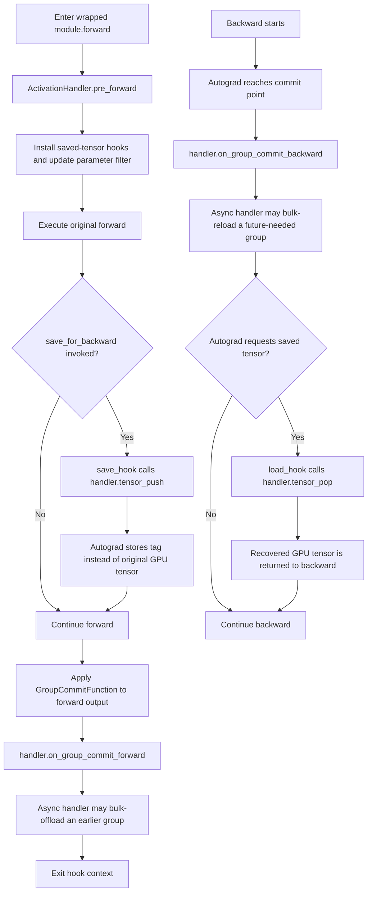
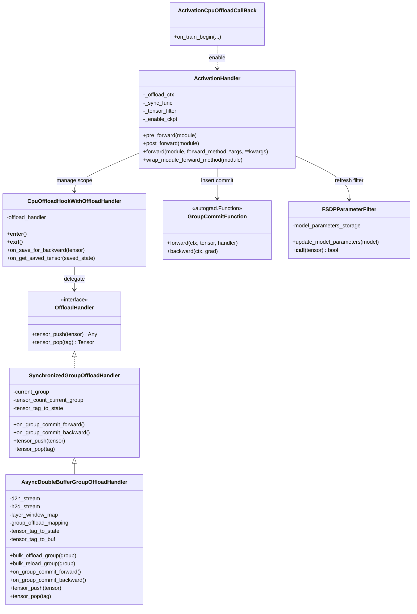

# ms-swift 中 Activation CPU Offload 的设计与实现

## 摘要

本文面向 `swift/callbacks/activation_cpu_offload.py`，系统说明 ms-swift 中 Activation CPU Offload 的设计动机、抽象接口、调度机制与工程集成方式。该实现以 PyTorch autograd 的 saved-tensor hooks 为基础，在不修改模型算子定义的前提下，将 backward 所需的中间激活从 GPU 迁移至 CPU，并在反向计算前按需恢复。为降低额外的数据传输开销，系统进一步引入基于 layer/group 的时序划分与双缓冲异步拷贝机制，使 device-to-host 与 host-to-device 传输能够尽可能与前向或反向计算重叠。当前实现主要服务于 FSDP/FSDP2 训练场景，并对 activation checkpointing 的兼容路径进行了专门处理。

## 1. 引言

大规模模型训练中的显存瓶颈并不只来自参数、梯度和优化器状态。即便采用 FSDP 或 ZeRO 等分片策略，autograd 在 forward 阶段保存的中间激活仍可能构成显存峰值的主要来源，尤其在长序列、深层网络或多模态模型场景下更为明显。Activation checkpointing 能以重算换显存，但其收益伴随着额外计算成本，且在部分训练配置下仍不足以满足显存预算约束。

Activation CPU Offload 的核心目标是将 saved-for-backward 的张量从 GPU 转移到 CPU，以释放高带宽显存资源，并在 backward 真正需要这些张量之前将其重新加载到原始 device。问题的难点不在于“能否搬运”，而在于“如何在保证 autograd 语义正确的前提下降低搬运对训练吞吐的影响”。因此，该实现关注两个方面：

- 语义正确性：offload/reload 必须与 autograd 的保存与取回时序严格对齐。
- 性能可接受性：数据传输应尽可能与计算重叠，而不是在关键路径上形成同步阻塞。

## 2. 问题定义与设计目标

### 2.1 问题定义

设模型前向传播由若干层级模块顺序组成。在 forward 过程中，部分算子会通过 `save_for_backward` 保存中间张量，以支持 backward 的梯度计算。若这些张量持续驻留于 GPU，则其累计占用可能主导峰值显存。本文讨论的问题可以形式化为：

- 输入：由一组被 autograd 保存的中间张量构成的 activation 集合；
- 目标：在不改变计算结果的前提下，将其中适合 offload 的张量临时迁移至 CPU；
- 约束：backward 访问时，系统必须恢复与原张量等价的 device、dtype 与 shape 语义；
- 优化方向：降低 GPU 峰值显存，同时控制 CPU 内存与 host-device 带宽开销。

### 2.2 设计目标

- 对模型代码透明，不要求修改算子或网络结构定义。
- 在 forward 阶段拦截 saved tensors，并将其转换为可追踪的轻量标识。
- 在 backward 阶段依据标识恢复真实张量，保证 autograd 正常求导。
- 支持同步与异步两类策略，以便分别覆盖正确性优先和性能优先场景。
- 与 FSDP/FSDP2 的层级包装方式协同工作，并兼容 activation checkpointing。

### 2.3 非目标

- 不追求对任意动态图结构给出全局最优搬运调度。
- 不扩展为通用 tensor swapping 系统，而是聚焦 saved-for-backward 激活。
- 当前实现不面向 FSDP/FSDP2 之外的训练策略提供通用支持。

## 3. 方法概述

该方案的基本思想是将 autograd 原本保存的 GPU 张量替换为一个轻量 tag，并由外部 handler 负责真实数据的生命周期管理。系统由三层组成：

1. 机制层：通过 saved-tensor hooks 拦截 `save_for_backward` 与 backward 取回动作。
2. 策略层：实现张量的 offload、reload、分组调度与同步控制。
3. 集成层：将 hooks 和调度逻辑嵌入被 FSDP/FSDP2 包裹的层级 forward 边界中。

这三层分别对应代码中的 `CpuOffloadHookWithOffloadHandler`、`OffloadHandler` 及其子类、`ActivationHandler` 与 `enable_activation_offloading`。

## 4. 核心机制

### 4.1 Saved-Tensor Hooks

PyTorch 提供了 saved-tensor hooks，用于拦截 autograd 保存和取回中间张量的过程。ms-swift 使用：

`torch._C._autograd._push_saved_tensors_default_hooks(save_hook, load_hook)`

在 forward 中，当算子尝试保存某个张量时，系统触发 `save_hook`；在 backward 中，当 autograd 需要该张量时，系统触发 `load_hook`。本文实现中，两个 hook 分别映射到：

- `on_save_for_backward(tensor) -> handler.tensor_push(tensor)`
- `on_get_saved_tensor(tag) -> handler.tensor_pop(tag)`

因此，autograd 图中实际保存的对象不再是原 GPU tensor，而是由 handler 生成并管理的 tag。该设计使系统能够在不修改模型算子实现的前提下接管 activation 的保存与恢复过程。

### 4.2 Hook 与 Handler 的职责分离

`CpuOffloadHookWithOffloadHandler` 仅负责 hook 的注册与注销，并将张量保存/取回请求委托给 handler。它不感知同步或异步策略，也不维护分组状态。相反，所有与策略有关的决策都由 handler 完成，包括：

- 是否对当前张量执行 offload；
- offload 是立即发生还是延迟到 group commit 点；
- backward 之前是否执行预取；
- CPU 副本与 GPU 引用如何索引与释放。

该分层的意义在于将 autograd 关键路径保持为最小逻辑单元，同时为策略演化留出清晰扩展点。

### 4.3 Group Commit 作为时序锚点

单纯依赖 `tensor_push` 和 `tensor_pop` 只能感知单个张量的保存与取回时机，难以支撑高效批量调度。为此，实现中引入 `GroupCommitFunction` 作为 dummy autograd op。该操作在数值上保持恒等映射，但在 forward 和 backward 两侧分别调用：

- `on_group_commit_forward()`
- `on_group_commit_backward()`

这一设计将“某一层 forward 已结束”和“backward 已回到对应层边界”显式编码进计算图，从而为 handler 提供稳定、对称的调度锚点。commit 点本身不改变张量值，其作用仅在于建立一组可靠的同步事件。

## 5. 分组调度策略

### 5.1 为什么采用 Group 而非逐张量调度

若每个 saved tensor 都独立执行 offload/reload，将引入大量细粒度拷贝和频繁同步，容易使数据传输本身成为主瓶颈。相比之下，按层或块对 activation 进行 grouping 具有两个优势：

- 有助于将多个张量合并为批量搬运操作，减少调度开销；
- 更符合 Transformer 类模型的层次结构，便于在 forward 与 backward 两侧构建对称时序。

在当前实现中，“group”近似对应一个被 FSDP/FSDP2 包裹的模块边界。每次被 wrap 的 module 完成 forward 后，`ActivationHandler` 都会触发一次 commit，从而推进 handler 的 group 状态。

### 5.2 Tag 编码与状态管理

在同步或异步 handler 中，saved tensor 的逻辑索引通常由 `(group_id, tensor_idx)` 组成。其作用包括：

- 标识张量所属的 group；
- 保证组内张量可以稳定索引；
- 为后续的批量 offload/reload 和状态恢复提供映射基础。

对应状态由 `tensor_tag_to_state` 等内部数据结构维护。异步实现还会使用 `group_offload_mapping` 和 `tensor_tag_to_buf` 等映射分别管理 CPU 副本、去重索引和延迟释放的 GPU 引用。

## 6. 具体实现

### 6.1 `SynchronizedGroupOffloadHandler`

`SynchronizedGroupOffloadHandler` 是一个以正确性为主要目标的基线实现。其行为可概括为：

- `tensor_push` 为张量生成 tag，并在需要 offload 时立即分配 CPU buffer 并完成复制；
- `tensor_pop` 在 backward 访问时将 CPU 副本同步恢复到原始 device；
- `on_group_commit_forward` 和 `on_group_commit_backward` 仅维护 group 计数，不引入额外异步调度。

该实现结构简单、易于验证，但拷贝动作与计算共享主 stream，因此数据传输往往会直接暴露为训练时延。

### 6.2 `AsyncDoubleBufferGroupOffloadHandler`

`AsyncDoubleBufferGroupOffloadHandler` 在同步版本基础上进一步引入异步双缓冲调度，是当前实现中的主要性能路径。其关键设计如下：

- 分配两个专用 stream：
  - `d2h_stream` 负责 device-to-host 传输；
  - `h2d_stream` 负责 host-to-device 传输。
- `tensor_push` 不立即执行 offload，而是先登记 GPU tensor，并在合适的 group commit 点统一处理。
- `bulk_offload_group(group_id)` 在 `d2h_stream` 上批量将某一组激活迁移至 CPU，并将 `tensor_tag_to_state` 中的 GPU 引用替换为轻量 `(key, shape)` 形式。
- `bulk_reload_group(group_id)` 在 `h2d_stream` 上批量恢复某一组激活，并在 backward 真正索取张量之前完成 state 回填。

在理想情况下，group `i` 的 offload 可以与 group `i+1` 的前向计算重叠，反向阶段的 reload 也可在对应层真正执行 backward 前提前发起。若单层计算时间足以覆盖 host-device 传输时间，则额外拷贝开销可被部分甚至大部分隐藏。

### 6.3 双缓冲中的窗口控制

异步策略并非在每个 commit 点都立即同步。为避免某一时刻集中触发大量传输，`AsyncDoubleBufferGroupOffloadHandler` 使用 `layer_window_map` 决定在何处执行同步、释放旧 group 的 GPU 引用，以及何时开始 offload 或 reload 下一组数据。其目标是：

- 尽量均匀地摊平 CPU/GPU 互连链路负载；
- 避免过早释放或过晚恢复带来的 stall；
- 将 GPU 上同时保留的 activation 组数控制在较低水平。

### 6.4 唯一键与重复存储消除

异步 handler 使用 `_get_unique_tensor_key` 为共享底层 storage 的张量生成唯一键，其形式基于 storage 指针、offset 与 dtype。这样做的目的是避免同一底层存储被重复 offload，多视图张量只需保存一次实际副本，再在 reload 后通过 shape 信息恢复逻辑视图。

## 7. 参数过滤与正确性约束

saved-tensor hooks 拦截到的对象并不必然都是“应被 offload 的激活”。某些场景下，参数相关张量也可能进入 hook 路径。为避免误处理参数，系统引入 `FSDPParameterFilter`：

- 维护当前模块参数的 storage 指针集合；
- 对被保存的张量进行 membership 判断；
- 仅当张量不属于参数存储时，才允许其进入 activation offload 流程。

由于 FSDP 训练过程中参数的实际 storage 可能随扁平化或重建而变化，`ActivationHandler.pre_forward()` 会在每次模块 forward 开始前调用 `update_model_parameters(module)` 更新过滤条件。这一机制是正确性的重要补充，否则错误地 offload 参数可能导致多余传输甚至语义偏差。

## 8. 与模型执行路径的集成

### 8.1 `ActivationHandler`

`ActivationHandler` 负责把 offload 逻辑嵌入目标模块的 forward 执行边界。其包装过程可分为四步：

1. `pre_forward`：在训练态进入 saved-tensor hooks 上下文，并刷新参数过滤器。
2. `forward`：执行原始 forward，必要时改走 checkpoint 兼容路径。
3. `sync_func`：对 forward 输出插入 `GroupCommitFunction`，作为本层的调度边界。
4. `post_forward`：退出 hooks 上下文。

这一结构同时满足两个需求：其一，只有被 wrap 模块 forward 内部产生的 saved tensors 才会被拦截；其二，commit 点能够与层边界稳定对齐。

### 8.2 `enable_activation_offloading`

`enable_activation_offloading(model, strategy, enable_ckpt)` 是系统装配入口。它首先递归遍历模型，识别被 FSDP/FSDP2 包裹的层级模块，并将其作为 offload group 的候选边界。随后，函数构造：

- `FSDPParameterFilter`
- `CpuOffloadHookWithOffloadHandler`
- `AsyncDoubleBufferGroupOffloadHandler`
- 基于 `GroupCommitFunction.apply` 的 `sync_func`

最后，它将 `ActivationHandler` 包装到目标模块的 `forward` 上。

当前实现默认采用 `num_offload_group = len(layers) - 1`。这意味着最后一组激活通常留在 GPU 上，从而减轻 backward 初段的 reload 压力。这一策略体现的是工程上的折中，而非理论最优结论。

### 8.3 `ActivationCpuOffloadCallBack`

`ActivationCpuOffloadCallBack` 是训练配置层面的入口。其在 `on_train_begin` 中读取 `fsdp_config.activation_cpu_offload` 和 `fsdp_config.activation_checkpointing`，并在模型已被 FSDP/FSDP2 包裹时启用该机制。因此，callback 本身不参与逐步张量搬运，而只负责一次性初始化与功能开关映射。

## 9. 与 Activation Checkpointing 的关系

Activation offload 与 activation checkpointing 目标相近，均试图降低训练中的 activation 显存，但二者作用方式不同：

- checkpointing 通过在 backward 时重算部分 forward 来减少保存的中间结果；
- offloading 通过跨 device 迁移 saved tensors 来换取显存空间。

两者可以联合使用，但也可能在具体实现上发生冲突，尤其是第三方库内部的 gradient checkpointing 路径可能改变 saved tensors 的生成方式或执行边界。为此，ms-swift 在 `enable_ckpt=True` 时禁用 transformers 原生 checkpoint 入口，转而在 `ActivationHandler` 内部使用 `torch.utils.checkpoint.checkpoint(use_reentrant=True)` 建立兼容路径。这一做法的本质是统一 activation 生命周期的控制权，以避免 hook 与 checkpoint 在时序上相互干扰。

## 10. 端到端执行流程

下面给出一次训练 step 的抽象流程图，用于说明 forward、commit、offload、reload 与 backward 之间的关系。

## 11. 结构关系

## 12. 复杂度、收益与代价

### 12.1 预期收益

- 降低 GPU 峰值 activation 显存。
- 在固定显存预算下支持更大的 batch size、序列长度或模型规模。
- 在层计算足够重、互连带宽充足时，异步方案能够将一部分传输开销隐藏在计算后面。

### 12.2 主要代价

- 额外消耗 CPU 内存以存放 activation 副本。
- 增加 CPU-GPU 互连链路压力，PCIe 环境下可能成为瓶颈。
- 引入额外的 stream 协调、group 调度和同步复杂度。

### 12.3 性能边界

该方案的有效性依赖 compute/transfer 比例。当单层计算时间显著大于对应 activation 的搬运时间时，异步 offload/reload 更容易被覆盖；反之，若模型层较浅、单层计算很短，或者 host-device 带宽较低，则性能收益会迅速下降，甚至可能退化为频繁同步等待。

## 13. 局限性与后续工作

当前实现仍具有若干局限：

- “group 近似等于 FSDP 包裹层”是一种工程启发式，不保证对所有模型结构都最优。
- 目前缺少统一的 telemetry 以量化显存节省、带宽占用和同步 stall 时间，不利于系统调优。
- 对复杂控制流、非标准层次结构或更一般训练策略的支持尚未扩展。
- NPU 场景下对 pinned memory 与异步传输的支持有限，因此更依赖同步退化路径。

若从性能收益与工程风险的平衡出发，下一阶段最值得优先实现的两项优化如下。

### 13.1 按 Group 建立显式索引，消除 bulk 阶段的全表扫描

当前异步实现中的 `bulk_offload_group` 与 `bulk_reload_group` 是通过遍历 `tensor_tag_to_state` 后筛选目标 `group_id` 来完成的。这种实现简单直接，但其调度开销会随着 saved tensor 总数增长而累积，导致 bulk 操作在 Python 侧产生额外线性扫描成本。更优的做法是显式维护 `group_id -> tensor_tags` 或 `group_id -> states` 的索引结构，使 offload、reload 与释放逻辑都能够直接按组访问。

这一优化的价值在于：

- 将 bulk 阶段的 Python 调度成本从“扫描全体 saved tensor”转为“只访问目标 group”；
- 降低大模型、长序列或深层网络下的调度放大效应；
- 为后续的 group 级 buffer packing、分组统计和事件管理提供更清晰的数据组织基础。

### 13.2 以事件驱动替代部分 commit 点同步，减少主计算流阻塞

当前实现中，forward 和 backward 的 group commit 阶段通过 `wait_stream` 在主计算流与拷贝流之间建立双向同步。这种设计便于保证正确性，但也可能过早暴露数据传输时延，使原本可被覆盖的 D2H/H2D 拷贝重新回到关键路径。更具性能潜力的方向是引入 event 驱动的依赖管理：仅在某组 activation 将被真正消费之前，再等待对应 offload 或 reload 完成，而不是在 commit 点统一等待。

这一优化的价值在于：

- 将同步从“固定时刻等待”转为“最晚消费点等待”，扩大计算与传输的重叠窗口；
- 降低 commit 点对主 stream 的阻塞概率，提升异步双缓冲的实际收益；
- 为更细粒度的预取策略与自适应调度提供基础机制。

后续可考虑从三个方向推进：其一，引入基于 profile 的自适应分组与窗口调度；其二，补充运行时观测指标，支持自动选择 offload 粒度；其三，将当前设计推广到更多并行训练范式与异构设备组合。

## 14. 结论

ms-swift 的 Activation CPU Offload 以 saved-tensor hooks 为切入点，建立了一个对模型透明、与 autograd 对齐的 activation 搬运框架。该框架通过 group commit 将层边界转化为调度锚点，并在异步实现中利用双 stream 和批量搬运机制降低传输对训练主路径的干扰。从工程角度看，它在 FSDP/FSDP2 训练中提供了一种有实际可用性的显存扩展手段；从设计角度看，其关键价值在于把“activation 生命周期管理”从模型实现中抽离出来，形成了机制层、策略层和集成层相互解耦的结构。
